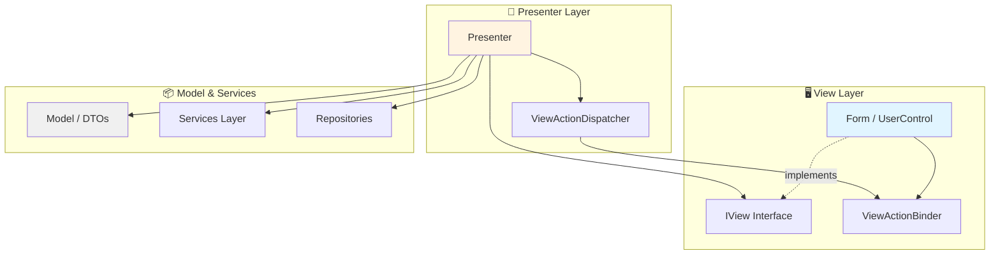
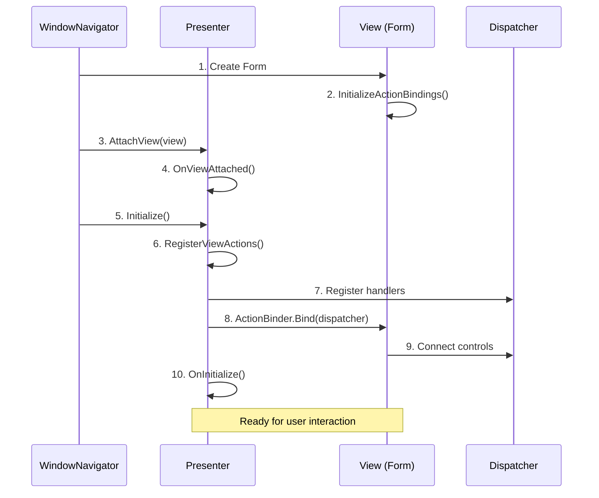

# 🎯 WinForms MVP Framework

[](https://dotnet.microsoft.com/download/dotnet-framework/net48)
[](LICENSE)
[](https://github.com/pasysxa/winforms-mvp)
[](https://github.com/pasysxa/winforms-mvp)

A modern, enterprise-grade **Model-View-Presenter (MVP)** framework for WinForms applications, bringing WPF-style command binding and clean architecture to .NET Framework 4.8.

[Features](#-core-features) • [Quick Start](#-quick-start) • [Documentation](CLAUDE.md) • [Examples](#-examples)

---

## 📖 Overview

WinForms MVP Framework solves the classic problems of WinForms development:
- **No separation of concerns** → Business logic mixed with UI code
- **Hard to test** → UI controls tightly coupled to logic
- **Event explosion** → Dozens of button click handlers
- **MessageBox hell** → Direct UI dependencies everywhere

This framework provides a **clean, testable architecture** with **minimal boilerplate** and **maximum productivity**.

### Why This Framework?

| Traditional WinForms | 🎯 This Framework |
|---------------------|------------------|
| ❌ Business logic in Form code-behind | ✅ Clean separation via Presenter |
| ❌ `MessageBox.Show()` scattered everywhere | ✅ Abstracted via `IMessageService` |
| ❌ Manual event wiring for every button | ✅ Declarative `ViewAction` system |
| ❌ No CanExecute support | ✅ Auto-enabled/disabled controls |
| ❌ Hard to unit test | ✅ Fully testable with mocks |
| ❌ Form references leak into logic | ✅ Interface-based View contracts |

---

## ✨ Core Features

### 🎮 ViewAction System
WPF's `ICommand` pattern for WinForms with type-safe action keys and automatic CanExecute support.

```csharp
// Presenter - No knowledge of buttons!
_dispatcher.Register(
    UserActions.Delete,
    OnDelete,
    canExecute: () => View.HasSelectedItem);  // Auto enable/disable

View.ActionBinder.Bind(_dispatcher);
```

```csharp
// Form - Internal UI binding
private void InitializeActionBindings()
{
    _binder = new ViewActionBinder();
    _binder.Add(UserActions.Delete, _deleteButton, _deleteMenuItem);
    // Multiple controls → one action!
}
```

### 🏗️ Perfect MVP Separation

**View Interface** - No UI types exposed:
```csharp
public interface IUserEditorView : IWindowView
{
    string UserName { get; set; }          // Data only
    bool HasSelectedUser { get; }          // State
    ViewActionBinder ActionBinder { get; } // Framework abstraction
    event EventHandler SelectionChanged;   // Events
}
```

**Form Implementation** - Owns UI details:
```csharp
public class UserEditorForm : Form, IUserEditorView
{
    private TextBox _nameTextBox;  // Private - not exposed!
    private Button _saveButton;    // Private - not exposed!

    public string UserName
    {
        get => _nameTextBox.Text;
        set => _nameTextBox.Text = value;
    }
}
```

**Presenter** - Pure business logic:
```csharp
public class UserEditorPresenter : WindowPresenterBase<IUserEditorView>
{
    private void OnSave()
    {
        _userRepository.Save(View.UserName);  // No Form knowledge!
        Messages.ShowInfo("User saved!");      // No MessageBox.Show()!
    }
}
```

### 🚀 Service Abstraction Layer

Never write `MessageBox.Show()` or `new OpenFileDialog()` again:

```csharp
// ❌ Traditional - Hard to test
MessageBox.Show("Error!", "Error", MessageBoxButtons.OK);

// ✅ Framework - Fully testable
Messages.ShowError("Error!", "Error");

// ❌ Traditional - Leaks WinForms
var dialog = new OpenFileDialog();
if (dialog.ShowDialog() == DialogResult.OK) { ... }

// ✅ Framework - Abstracted
var result = Dialogs.ShowOpenFileDialog();
if (result.IsSuccess) { ... }
```

### 🎨 Flexible Dependency Injection

**Service Locator** (rapid prototyping):
```csharp
protected override void OnSave()
{
    Messages.ShowInfo("Saved!");  // Built-in convenience properties
}
```

**Constructor Injection** (production code):
```csharp
public MyPresenter(IMessageService messages, IUserRepository users)
{
    _messages = messages;
    _users = users;
}
```

**Hybrid** (recommended):
```csharp
public MyPresenter(IUserRepository users)  // Business services injected
{
    _users = users;
    Messages.ShowInfo("Ready!");  // Platform services via properties
}
```

### 🪟 Advanced Window Navigation

```csharp
// Modal dialog with parameters and result
var result = navigator.ShowWindowAsModal<EditUserPresenter, UserId, UserModel>(
    presenter,
    userId: 123);

if (result.IsSuccess)
{
    var user = result.Value;
    // ...
}

// Singleton window (document-style)
var window = navigator.ShowWindow<DocumentPresenter>(
    presenter,
    keySelector: p => documentId);  // Only one per document
```

### 📊 Change Tracking

Built-in edit/cancel support with thread-safe implementation:

```csharp
var tracker = new ChangeTracker<UserModel>(originalUser);

// User edits...
View.Model = tracker.CurrentValue;

// Save or cancel
if (confirmed)
    tracker.AcceptChanges();
else
    tracker.RejectChanges();  // Restore original
```

### 🔄 ActionRequest Pattern

Eliminate event explosion:

```csharp
// ❌ Traditional - Event hell
event EventHandler AddRequested;
event EventHandler EditRequested;
event EventHandler DeleteRequested;
// ... 10 more events

// ✅ Framework - One event
event EventHandler<ActionRequestEventArgs> ActionRequested;
```

---

## 🏛️ Architecture



### Lifecycle Flow



---

## 🚀 Quick Start

### 1. Install

```bash
# Clone the repository
git clone https://github.com/pasysxa/winforms-mvp.git

# Build the solution
dotnet build src/winforms-mvp.sln
```

### 2. Define View Interface

```csharp
public interface IUserEditorView : IWindowView
{
    string UserName { get; set; }
    string Email { get; set; }
    bool HasUnsavedChanges { get; }

    ViewActionBinder ActionBinder { get; }
    event EventHandler DataChanged;
}
```

### 3. Create Presenter

```csharp
public class UserEditorPresenter : WindowPresenterBase<IUserEditorView>
{
    protected override void RegisterViewActions()
    {
        _dispatcher.Register(CommonActions.Save, OnSave,
            canExecute: () => View.HasUnsavedChanges);
        _dispatcher.Register(CommonActions.Cancel, OnCancel);

        View.ActionBinder.Bind(_dispatcher);
    }

    private void OnSave()
    {
        // Save logic
        Messages.ShowInfo("User saved successfully!");
    }
}
```

### 4. Implement Form

```csharp
public class UserEditorForm : Form, IUserEditorView
{
    private ViewActionBinder _binder;
    public ViewActionBinder ActionBinder => _binder;

    public UserEditorForm()
    {
        InitializeComponent();
        InitializeActionBindings();
    }

    private void InitializeActionBindings()
    {
        _binder = new ViewActionBinder();
        _binder.Add(CommonActions.Save, _saveButton);
        _binder.Add(CommonActions.Cancel, _cancelButton);
    }

    public string UserName
    {
        get => _nameTextBox.Text;
        set => _nameTextBox.Text = value;
    }
}
```

### 5. Show Window

```csharp
var viewMappingRegister = new ViewMappingRegister();
viewMappingRegister.RegisterFromAssembly(Assembly.GetExecutingAssembly());

var navigator = new WindowNavigator(viewMappingRegister);
var presenter = new UserEditorPresenter();

navigator.ShowWindow(presenter);
```

---

## 📚 Examples

The repository includes comprehensive examples:

### 🎮 [ViewAction System](src/WinformsMVP.Samples/ViewActionExample.cs)
- Static ActionKey classes
- CanExecute predicates
- Multi-control binding
- Automatic UI state updates

### ☑️ [CheckBox Demo](src/WinformsMVP.Samples/CheckBoxDemo)
- CheckBox/RadioButton binding
- Theme selection with RadioButtons
- Settings UI pattern

### 📝 [ToDo Demo](src/WinformsMVP.Samples/ToDoDemo)
- Full CRUD operations
- State-driven CanExecute
- Change tracking
- Mock service testing

### 🧭 [Navigator Demo](src/WinformsMVP.Samples/NavigatorDemo)
- Modal/non-modal windows
- Parameterized dialogs
- Singleton windows
- Window lifecycle management

### 📊 [Bulk Binding](src/WinformsMVP.Samples/BulkBindingDemo)
- Survey/questionnaire patterns
- `AddRange()` for efficiency
- Many-to-many control binding

### 🔄 [MVP Comparison](src/WinformsMVP.Samples/MVPComparisonDemo)
- Passive View pattern
- Supervising Controller pattern
- Side-by-side comparison

### 👥 [Master-Detail Pattern](src/WinformsMVP.Samples/MasterDetailDemo) **NEW!**
- Parent-child data relationships (Customers → Orders)
- Coordinated UI updates across master and detail views
- Cascading delete with confirmation
- Real-time total calculation
- State-driven CanExecute for CRUD operations

### ✅ [Complex Validation](src/WinformsMVP.Samples/ValidationDemo) **NEW!**
- Real-time field-level validation
- Cross-field validation (password confirmation)
- Pattern matching (email, phone number)
- Business rule validation (age restrictions)
- Visual error feedback with colored fields
- Validation summary display

### ⚡ [Async Operations](src/WinformsMVP.Samples/AsyncDemo) **NEW!**
- Proper async/await patterns in Presenters
- Progress tracking with progress bar
- Cancellation support (CancellationToken)
- Error handling in async methods
- Long-running operations without UI freezing
- Multiple async operation patterns

---

## 🧪 Testing

The framework is designed for testability:

```csharp
[Fact]
public void OnSave_WithValidData_ShowsSuccessMessage()
{
    // Arrange
    var mockMessages = new MockMessageService();
    var mockView = new MockUserEditorView
    {
        UserName = "John",
        HasUnsavedChanges = true
    };

    var presenter = new UserEditorPresenter(mockMessages);
    presenter.AttachView(mockView);
    presenter.Initialize();

    // Act
    presenter.OnSave();  // Accessible via ActionDispatcher

    // Assert
    Assert.True(mockMessages.InfoMessageShown);
    Assert.Contains("saved", mockMessages.LastMessage);
}
```

**Test Results**: ✅ 41/41 tests passing

---

## 📖 Documentation

- **[CLAUDE.md](CLAUDE.md)** - Comprehensive architecture guide
  - MVP principles and patterns
  - ViewAction system deep dive
  - Service layer design
  - Navigation system
  - Change tracking
  - Best practices and anti-patterns

---

## 🛠️ Technology Stack

- **.NET Framework 4.8** - Target framework
- **C# 7.3+** - Language features
- **xUnit 2.9** - Testing framework
- **SDK-Style Projects** - Modern project format

---

## 📦 Project Structure

```
winforms-mvp/
├── src/
│   ├── WinformsMVP/                    # Core framework
│   │   ├── MVP/
│   │   │   ├── Presenters/             # Presenter base classes
│   │   │   ├── Views/                  # View interfaces
│   │   │   └── ViewActions/            # ViewAction system
│   │   ├── Services/                   # Service abstractions
│   │   └── Common/                     # Utilities (ChangeTracker, etc.)
│   │
│   ├── WinformsMVP.Samples/            # Sample applications
│   │   ├── ViewActionExample.cs        # ViewAction demo
│   │   ├── ToDoDemo/                   # Full CRUD example
│   │   ├── NavigatorDemo/              # Navigation patterns
│   │   ├── CheckBoxDemo/               # CheckBox/RadioButton
│   │   ├── BulkBindingDemo/            # Survey/questionnaire
│   │   └── MVPComparisonDemo/          # Pattern comparison
│   │
│   └── WinformsMVP.Samples.Tests/      # Unit tests
│
├── CLAUDE.md                           # Architecture documentation
└── README.md                           # This file
```

---

## 🎯 Use Cases

This framework is ideal for:

- ✅ **New WinForms Projects** - Start with clean architecture
- ✅ **Legacy Modernization** - Gradually refactor existing code
- ✅ **Enterprise Applications** - Maintainable, testable code
- ✅ **Team Standardization** - Consistent patterns across team
- ✅ **Training & Education** - Learn MVP architecture

---

## 🤝 Contributing

Contributions are welcome! Please feel free to submit a Pull Request.

---

## 📄 License

This project is licensed under the MIT License - see the [LICENSE](LICENSE) file for details.

---

## 🌟 Show Your Support

If this framework helped you, please give it a ⭐️ on GitHub!

---

## 📬 Contact

For questions and support, please open an issue on GitHub.

---

<div align="center">

**[⬆ Back to Top](#-winforms-mvp-framework)**

Made with ❤️ for the WinForms community

</div>
